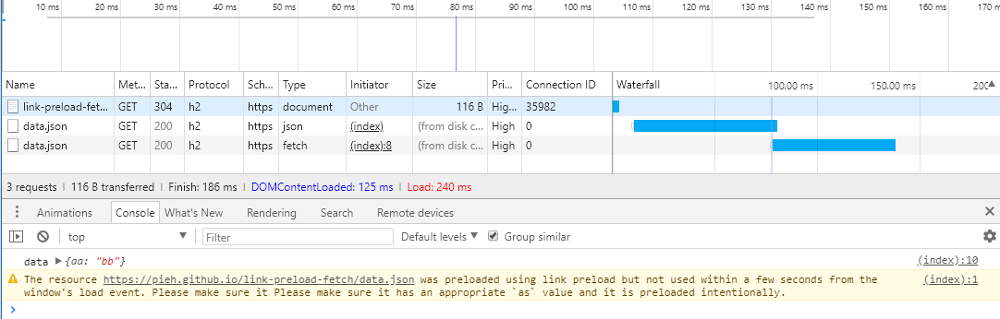

Using link preload as="fetch" double downloads file. What am i missing?

Link: [https://pieh.github.io/link-preload-fetch/](https://pieh.github.io/link-preload-fetch/)

```html
<head>
    <html>
        <link rel="preload" href="data.json" as="fetch" />
    </html>
    <body>
        Check developer tools -> network tab
        <script>
            fetch("data.json").then(function(response) {
                response.json().then(function(json) {
                    console.log('data', json)
                })
            })
        </script>
    </body>
</head>
```



